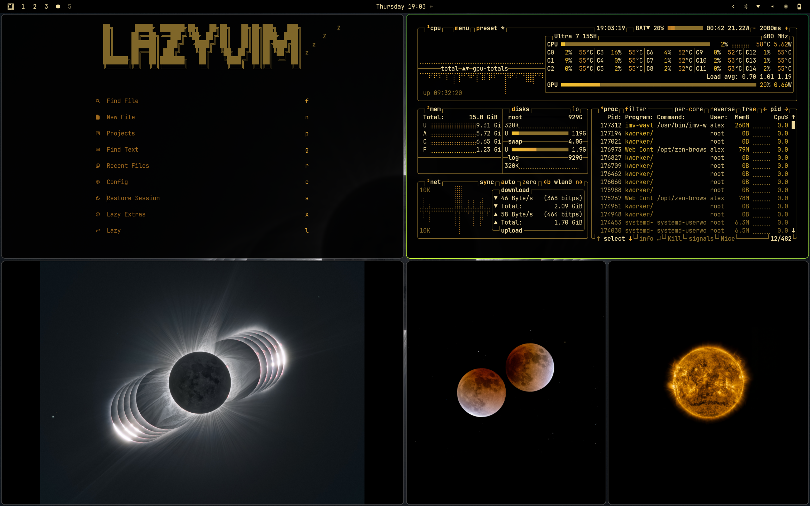

# Omarchy Sun Theme

A warm, solar and eclipse theme for [Omarchy](https://omarchy.org). Inspired by [steve-lohmeyer/omarchy-mars-theme](https://github.com/steve-lohmeyer/omarchy-mars-theme).

<p align="center">
  
</p>

## Installation

```bash
omarchy-theme-install https://github.com/LeblancAlex/omarchy-helios-theme.git
```

Or via the Omarchy menu: `Super + Alt + Space` → Install → Style → Theme, then paste this repo's URL.

## Included Configurations

- Alacritty (`alacritty.toml`)
- btop (`btop.theme`)
- Chromium (`chromium.theme`)
- Ghostty (`ghostty.conf`)
- Hyprland (`hyprland.conf`, `hyprlock.conf`)
- Icons (`icons.theme`)
- Mako (`mako.ini`)
- Neovim (`neovim.lua`)
- SwayOSD (`swayosd.css`)
- VS Code (`vscode.json`)
- Walker (`walker.css`)
- Waybar (`waybar.css`)
- Desktop backgrounds (`backgrounds/`)

## Image Credits

Wallpapers courtesy of NASA/GSFC/SDO and ESA & NASA/Solar Orbiter/EUI Team. ESA images licensed under [CC BY-SA 3.0 IGO](https://creativecommons.org/licenses/by-sa/3.0/igo/).

## License

MIT — see [LICENSE](LICENSE).
